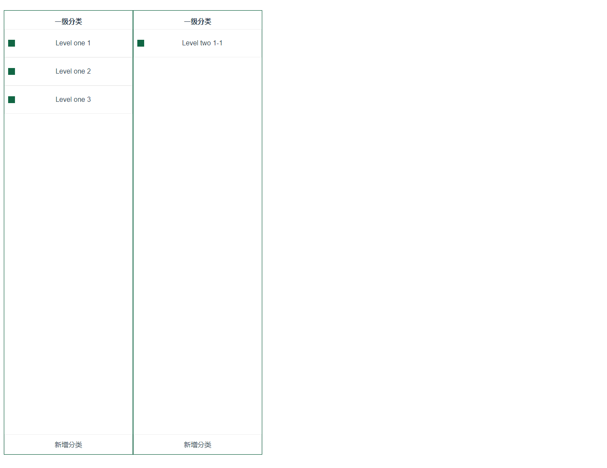

# element-plus-tree-min


## 仿写element-plus的 el-tree 并改变

目前是最小实现
点击展示下一级




## Project setup
```
yarn install
```

### Compiles and hot-reloads for development
```
yarn start
```

### Compiles and minifies for production
```
yarn build
```

### Lints and fixes files
```
yarn lint
```

### Customize configuration
See [Configuration Reference](https://cli.vuejs.org/config/).
